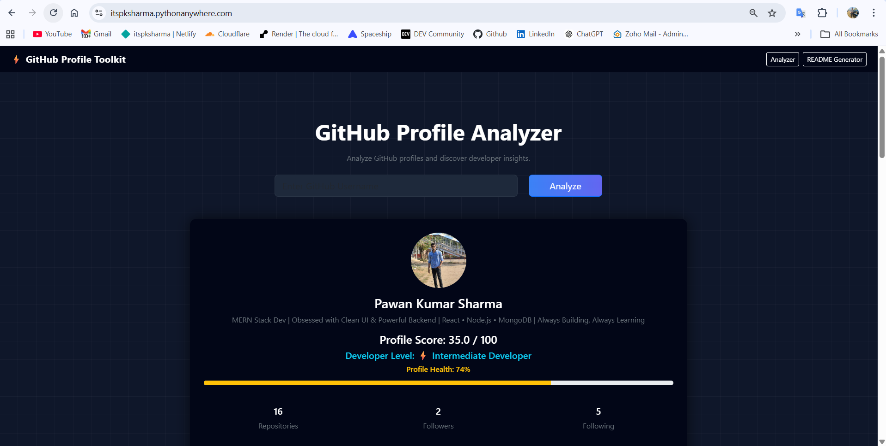
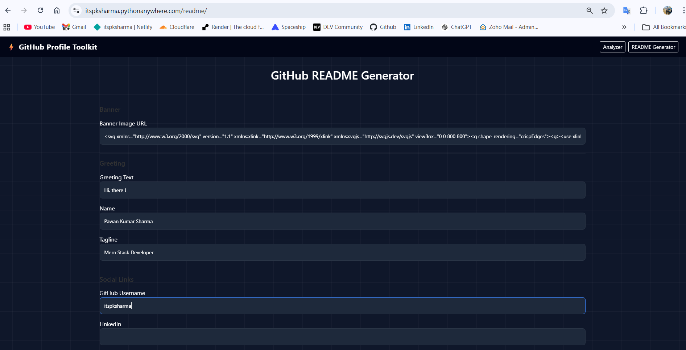
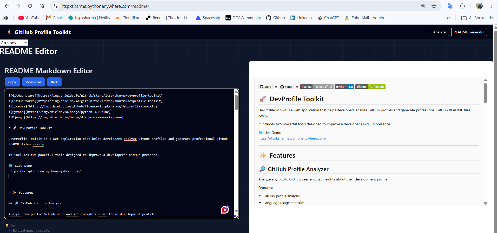

# 🚀 DevProfile Toolkit

DevProfile Toolkit is a web application that helps developers analyze GitHub profiles and generate professional GitHub README files easily.

It includes two powerful tools designed to improve a developer’s GitHub presence.

🌐 Live Demo  
https://itspksharma.pythonanywhere.com/

---

# ✨ Features

## 🔎 GitHub Profile Analyzer

Analyze any public GitHub user and get insights about their development profile.

Features:

- GitHub profile analysis
- Language usage statistics
- Developer tech stack insights
- Repository activity overview
- Developer profile summary generation

Simply enter a GitHub username to analyze the profile instantly.

---

## 📝 GitHub README Generator

Generate a professional GitHub README file using a simple form.

Features:

- Form-based README builder
- Live README preview
- Markdown editor
- Ready-to-use README.md output
- Copy or download generated README

Perfect for developers who want to create a professional GitHub profile README quickly.

---

# 🖥️ Screenshots

### GitHub Profile Analyzer

### README Generator Editor

### README Preview

---

# 🛠️ Tech Stack

Frontend  
- HTML  
- CSS  
- JavaScript  

Backend  
- Python  
- Django  

API  
- GitHub Public API

Deployment  
- PythonAnywhere

---

# 📂 Project Structure
devprofile-toolkit
│
├── analyzer
├── generator
├── templates
├── static
├── manage.py
├── requirements.txt
└── README.md

---

# ⚙️ Installation (Run Locally)

Clone the repository

git clone https://github.com/itspksharma/devprofile-toolkit.git

Go into project directory

cd devprofile-toolkit

Create virtual environment

python -m venv venv

Activate virtual environment

Windows

venv\Scripts\activate

Install dependencies

pip install -r requirements.txt

Run the server

python manage.py runserver

Open in browser

http://127.0.0.1:8000/

---

# 🎯 Use Cases

• GitHub Profile Analysis  
• Developer Skill Insights  
• GitHub README Generator  
• Portfolio Enhancement Tool  
• Developer Profile Optimization

---

# 📜 License

This project is licensed under the MIT License.

---

# 👨‍💻 Author

**Pawan Kumar Sharma**

GitHub  
https://github.com/itspksharma

Portfolio  
https://askdevpk.me

---

⭐ If you like this project, please give it a star!